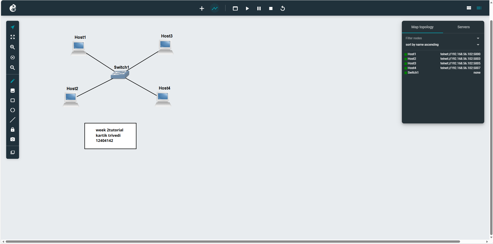

WEEK2 TUTORIAL 

To learn three different methods of configuring static IP addresses on a Linux host.

 Activities Performed
 
Created a GNS3 project:
Setting-IP-12304142

Added:
4 × Linux Host nodes
1 × Ethernet switch
Connected all devices in a LAN

